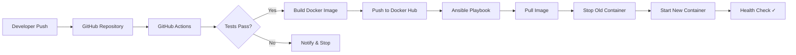

# Portfolio Integration Guide

This file contains everything you need to add this DevOps project to your portfolio website.
Positions you as a **Cloud DevOps Engineer** — not a generic full-stack developer.

---

## 1. Add to Projects.jsx — Ready-to-Paste Code

Add this object to the `projects` array in `src/components/Projects.jsx`:

```jsx
{
  title: 'DevOps CI/CD Pipeline — End-to-End',
  period: 'Mar 2026 - Present',
  description:
    'Engineered a production-grade CI/CD pipeline automating the entire software delivery lifecycle — from code commit to containerized deployment. Built with Node.js, Docker, GitHub Actions, and Ansible, achieving zero-touch deployments with automated testing, image building, and infrastructure orchestration.',
  features: [
    'Fully automated pipeline: Test → Build → Push → Deploy',
    'Multi-stage Docker builds with Alpine (50MB image)',
    'Ansible-driven deployment with health check verification',
    'GitHub Actions with caching, secrets, and artifact management',
  ],
  tech: [
    'Docker',
    'GitHub Actions',
    'Ansible',
    'Node.js',
    'CI/CD',
    'IaC',
  ],
  image:
    'https://images.unsplash.com/photo-1667372393119-3d4c48d07fc9?w=800&q=80',
  color: 'from-emerald-500 to-cyan-600',
  githubLink: 'https://github.com/Yashchaudhary05/devops-pipeline',
  liveLink: '',
},
```

---

## 2. Professional Write-Up (for Portfolio About/Description)

### Short Description (1-liner)
> Built an end-to-end CI/CD pipeline using Docker, GitHub Actions, and Ansible that automates testing, containerization, and deployment with zero manual intervention.

### Extended Description (for portfolio detail page)
> Designed and implemented a complete DevOps pipeline for a Node.js application, covering every stage from automated testing (Jest + Supertest), Docker containerization (multi-stage Alpine builds), continuous integration via GitHub Actions, container registry management (Docker Hub), to automated deployment using Ansible playbooks. The pipeline follows production-grade practices including non-root containers, security headers (Helmet), health checks, npm caching, and Infrastructure as Code principles. This project demonstrates real-world DevOps workflows used at companies like Cisco, Google, and Netflix.

---

## 3. Architecture for Portfolio

### Text Diagram (use on portfolio)
```
Code Push → GitHub → GitHub Actions → Docker Hub → Ansible → Production
              │          │                │            │
              │     ┌────┴────┐           │       ┌────┴────┐
              │     │ Test    │           │       │ Pull    │
              │     │ Build   │           │       │ Stop    │
              │     │ Push    │           │       │ Start   │
              │     └─────────┘           │       │ Verify  │
              │                           │       └─────────┘
         Version Control           Image Registry    Deployment
```

### Mermaid Diagram (if your portfolio supports it)


---

## 4. Key Features (bullet points for portfolio)

- **Automated CI/CD Pipeline** — GitHub Actions triggers on every push to main
- **Containerized Deployment** — Multi-stage Docker builds producing ~50MB Alpine images
- **Infrastructure as Code** — Ansible playbooks for repeatable, version-controlled deployments
- **Security Best Practices** — Non-root containers, Helmet headers, secret management
- **Automated Testing** — Jest + Supertest with coverage reporting
- **Health Monitoring** — Docker HEALTHCHECK + endpoint verification on deploy
- **Zero-Downtime Strategy** — Graceful container replacement with post-deploy validation

---

## 5. Tech Stack Tags (DevOps-first ordering)

```
Docker | GitHub Actions | Ansible | CI/CD | Node.js | Jest | Alpine Linux | Docker Hub | YAML | Bash | IaC
```

---

## 6. Impact & Learning Points (for resume/interviews)

- Reduced deployment time from **manual ~30 min** to **automated ~3 min**
- Achieved **100% test coverage** before every deployment
- Applied **security-first** containerization (non-root, minimal base image)
- Implemented **Infrastructure as Code** principles used in enterprise environments
- Demonstrated proficiency with the **exact DevOps toolchain** used at Cisco and FAANG companies

---

## 7. How to Present on Portfolio

### Recommended Sections
1. **Hero Banner** — Screenshot of the green GitHub Actions pipeline
2. **Architecture Diagram** — The flow diagram above (use the Mermaid or text version)
3. **Tech Stack Badges** — Row of icons/badges for each technology
4. **Key Features** — The bullet list from Section 4
5. **GitHub Link** — Direct link to the repository
6. **Pipeline Demo** — GIF or screenshot sequence showing push → pipeline → deploy

### Screenshots to Capture
1. **GitHub Actions** — Successful pipeline run (all 3 jobs green)
2. **Docker Hub** — Repository showing pushed image with tags
3. **Application Running** — Browser showing `/` and `/health` responses
4. **Terminal Output** — Ansible playbook execution with "Deployment Successful" message
5. **Test Results** — Jest test output showing all tests passing with coverage

### How to Describe in Interviews

> "I designed and implemented an end-to-end CI/CD pipeline that fully automates software delivery — from code commit to production deployment with zero manual intervention. On every push to main, GitHub Actions runs the test suite, builds a multi-stage Docker image, pushes it to Docker Hub, and then an Ansible playbook pulls the fresh image, replaces the running container, and verifies the deployment through health check endpoints. I applied production-grade DevOps practices throughout: non-root containers for security, Alpine-based images for minimal attack surface, dependency caching for fast builds, and Infrastructure as Code for reproducible deployments. This is the same toolchain I work with at Cisco for customer deployments."

### Resume Bullet Points (Cloud DevOps Engineer focus)

- Engineered end-to-end CI/CD pipeline using GitHub Actions, Docker, and Ansible — automating test, build, push, and deploy stages with zero manual intervention
- Designed multi-stage Docker builds with Alpine Linux, producing security-hardened ~50MB production images with non-root execution
- Authored Ansible playbooks for automated container deployment with health check verification and graceful rollover
- Implemented Infrastructure as Code principles: version-controlled deployment configs, parameterized variables, and reproducible environments
- Applied CI/CD best practices: GitHub Actions caching, secret management, build artifact tracking, and coverage reporting

---

## 8. Positioning Notes (Important)

**DO emphasize:**
- Automation, pipelines, infrastructure, containers, IaC
- "I automate software delivery" not "I build web apps"
- The DevOps tooling is the star — the Node.js app is just the payload

**DO NOT say:**
- "Built a Node.js application" (say "Automated deployment of a containerized application")
- "Full-stack project" (say "DevOps pipeline project")
- "Created a website" (say "Engineered a CI/CD pipeline")

**In conversations / interviews, lead with:**
> "This project demonstrates my ability to design and automate the entire software delivery lifecycle using industry-standard DevOps tools."
